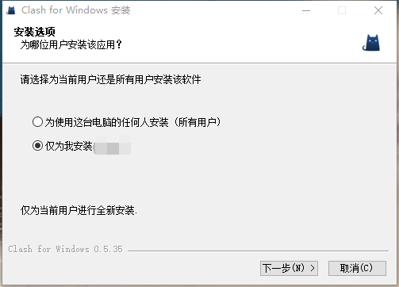
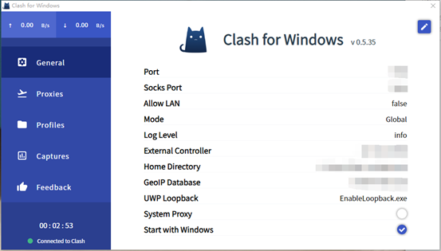
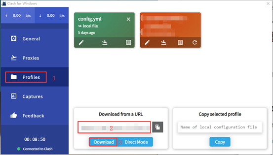
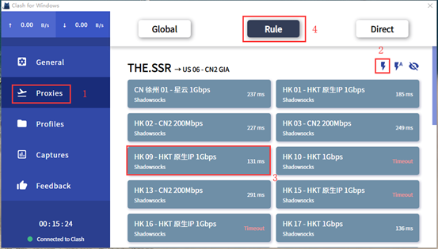
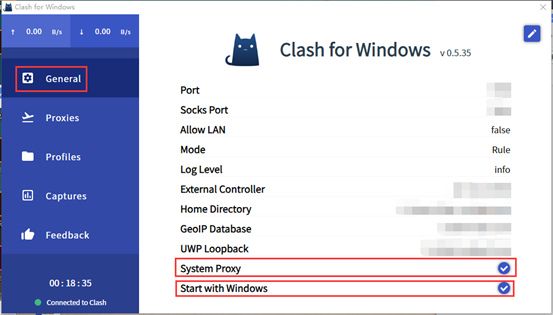

# Windows - Clash

- 系统要求： Windows 7 以上
- 设备要求： Windows 计算机 & 平板
- [点此下载软件安装包](https://download.blinkload.net/Clash.for.Windows-0.5.35-win.zip)

> 此软件支持规则分流，推荐使用。

### 软件安装

1. 您可以在上方找到适用于 **Windows** 的 Clash 安装包，解压并安装完毕后打开软件即可。

   

2. 安装完成后双击桌面图标打开 **Clash for Windows**，即可在任务栏中看到如图所示的**小猫图标**（颜色会因配置不同而**改变**）。

   

### 导入节点设置

?> 订阅链接获取教程可以[在此找到

1. 双击任务栏的 **Clash for Windows** 图标即可打开客户端面板。

2. 选择客户端左侧 **Profiles** 选项，将 **Clash 订阅地址**粘贴至**第二步红框**中，然后点击 **Download** 即可在 Proxy 中找到您的节点。

### 软件设置

1. 选择客户端左侧 **Proxies** 选项，点击⚡，选择一条可用线路，最后点击 **Rule(按规则分流)** 或者 **Global(全局)** 开始使用。

2. 选择客户端左侧 **General** 选项，将 **System Proxy** 以及 **Start with Windows** 选项都**打上勾**，即配置完毕。

   !> 由于 Windows 客户端**无法创建系统级代理**，可能会导致**一部分**不遵守系统代理规定的应用程序无法将流量转发至代理(即**无法使用代理**)。此时您需要进入软件中手动配置代理，我们的人工客服也将可以协助您设置。

