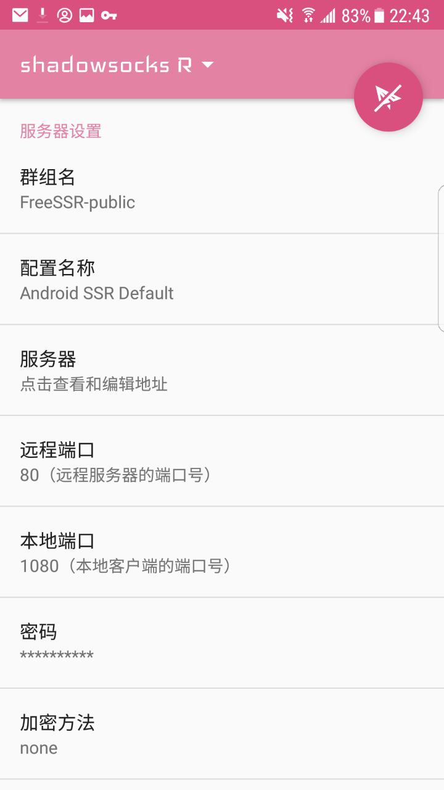
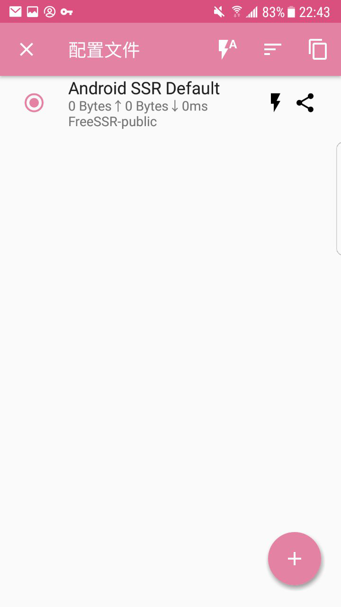
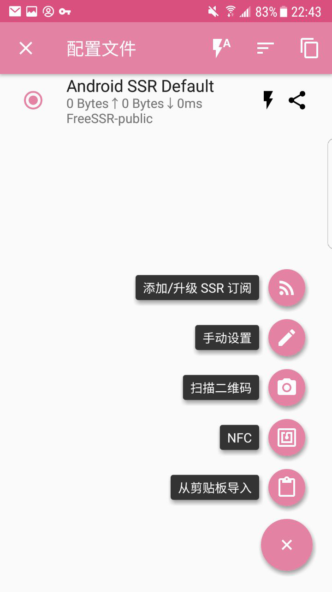
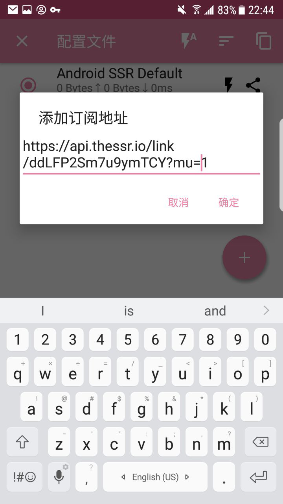
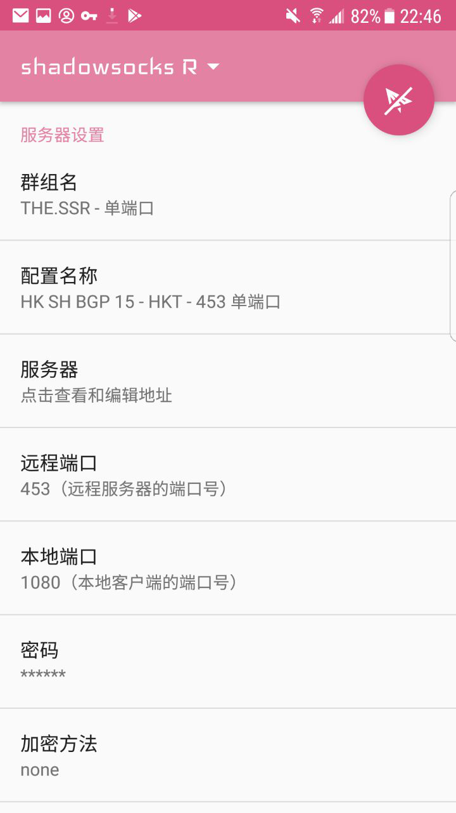

# Android - SSR(R) #
- 系统要求： Android 4.0 及以上
- 设备要求： Android手机或平板设备
- [点此下载软件](https://download.{$DOMAIN}}/shadowsocksr-release.apk)

### 软件安装 ###
!> 由于HUAWEI等厂商的OEM系统对于SSR的阻碍。当您在一些设备上无法使用时，请提交工单或联系网页客服。

您可以在上方找到适用于Android的ShadowsocksR **APK安装包**，安装完毕后打开软件即可。

### 导入节点设置 ###
1.打开 SSR(R) 应用程序。

2.点击顶部的[shadowsocks R▼]进入**节点列表**。

3.在[Android SSR Default]处向右滑动，以便删除软件自带的无效节点。

4.点击右下角[+]按钮。

5.选择[添加/升级 SSR 订阅]。

6.在弹出的窗口中删除自带无效订阅。（由于FreeSSR源已**停止维护**，将其置于订阅列表中可能影响订阅更新的速度）

7.再次点击[+]。

8.点击[添加/升级 SSR 订阅]

9.点击[添加订阅地址]，输入您的**订阅链接**。

?> 订阅连接获取教程可以[在此找到](/panel?id=连接信息)

10.勾选[自动更新]，并点击[确定并升级]。

完成以上步骤后，节点列表将显示所有可用节点。

### 软件设置 ###
?> 在这里我们将指导您设置软件，如果您曾经使用过SSR(R)，则可以选择跳过此部分

1. 点击[路由]，选择[仅代理中国大陆无法访问的地址]。
2. 如需使用，只需点击右上角小飞机图标。若要查看延迟，请点击[检查网络连接]。
