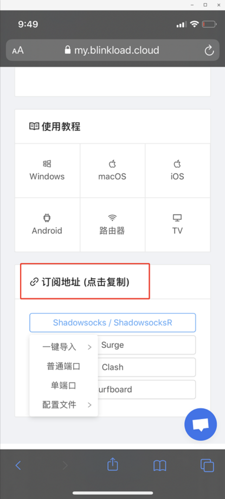
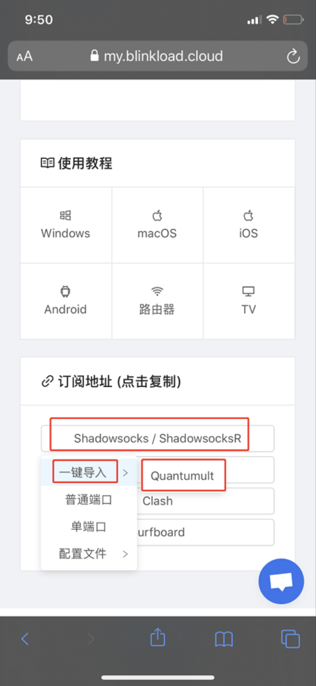
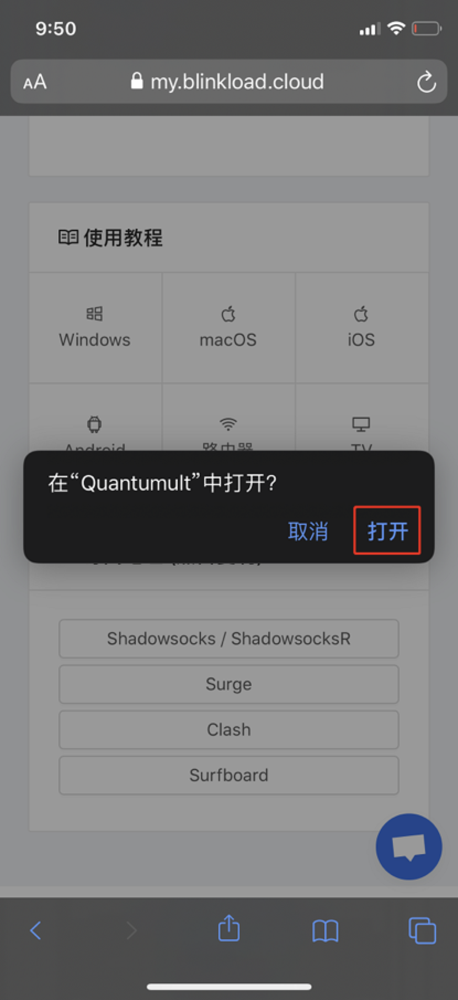
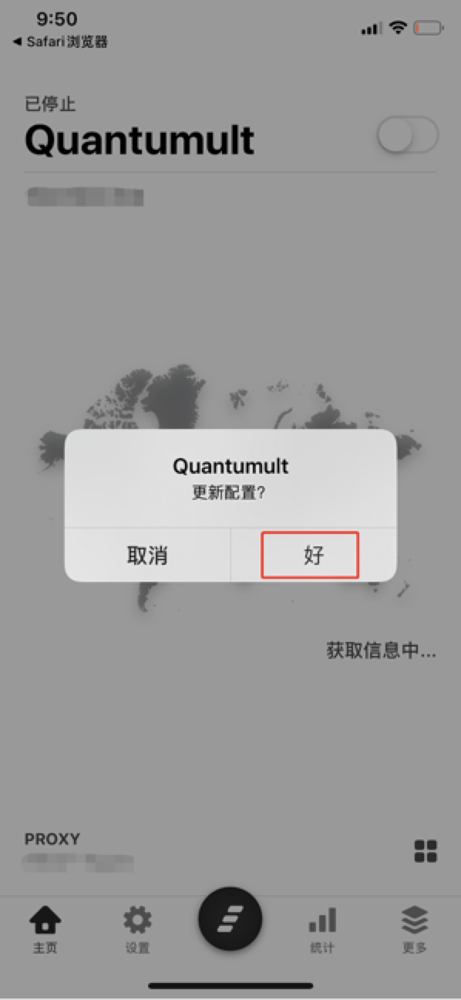
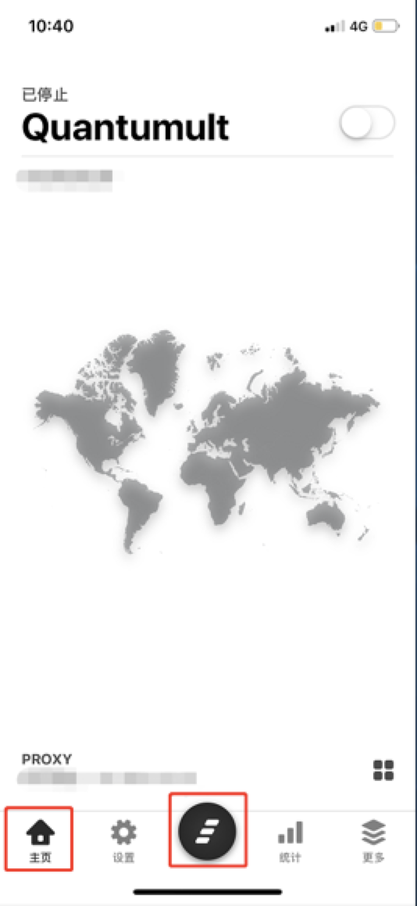
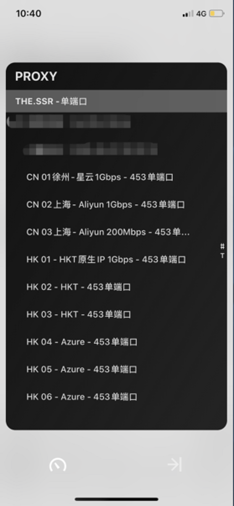
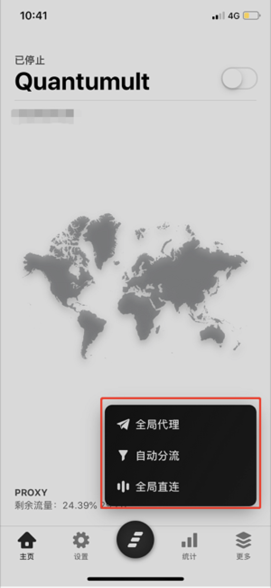
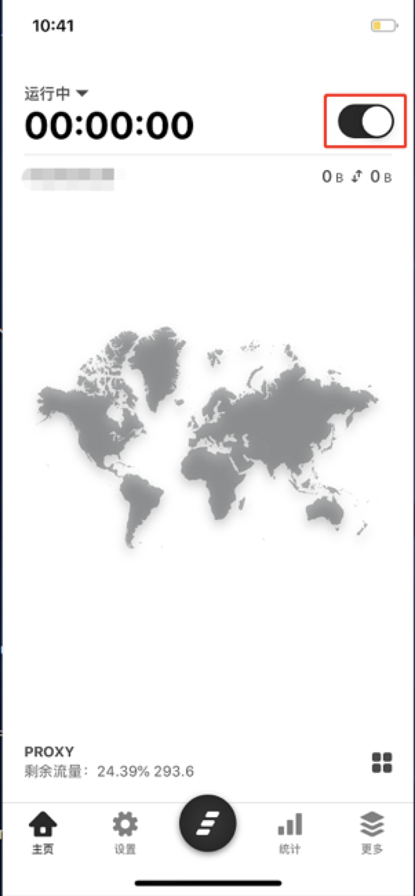

# iOS - Quantumult #
- 系统要求： iOS 10及以上
- 设备要求： 运行有 iOS 的设备
- 阁下可以从下方教程中了解如何安装

### 软件安装 ###
!> 由于中国区 Quantumult 已下架，阁下可使用自己的**其他国家区域**账号购买 Quantumult 或者使用我们提供的美区账号，您可以联系客服获取。

### 导入节点设置 ###

1. 使用 Safari 浏览器打开我们的网站，登陆账号进入**用户中心**页面**，**下拉滑到底部，至**订阅地址**板块

   

2. 在**订阅地址**板块中，点击下方的**「Shadowsocks/ShadowsocksR」-「一键导入」-「Quantumult」**

   

3. 接下来在弹出的提示**「在Quantumult中打开？」**中点击**「打开」**选项，即可跳转至Quantumult客户端

   

4. 接下来在Quantumult客户端中弹出的**「更新配置？」**窗口，选择**「好」**，即可获得**「已更新」**的弹窗提示，再次点击**「好」**

   
?> 至此，您已经成功的导入了节点，接下来我们将为您展示如何开始使用。

### 软件设置 ###

1. 点击软件下方**「主页」**选项，点击下方中间的**「Quantumult Logo」**，即可显示节点

   

2. **点击选择**您想要使用的**线路**

   

3. 点击**右下方的**四个方块的图标，可以按需选择 3 种连接模式，这里推荐选择**「自动分流」**

   

4. **打开开关**，即可使用

   