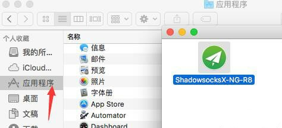
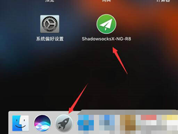
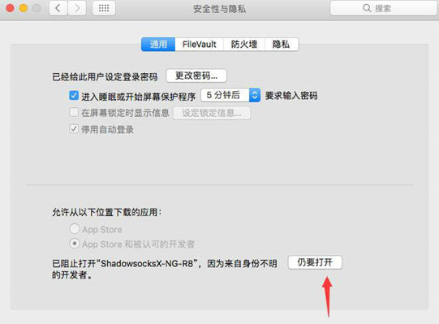
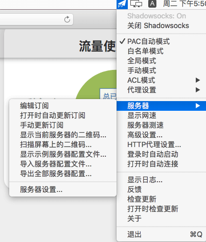
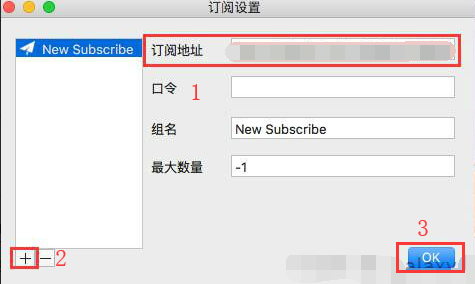
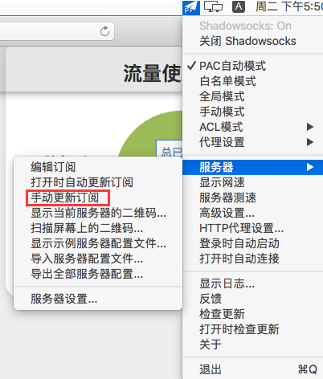

# macOS - ShadowsocksX-NG-R8 #
- 系统要求： macOS 10.11 以上
- 设备要求： Macbook / Macbook Air / Mackbook Pro / iMac / iMac Pro / Mac Pro / Mac mini
- [点此下载软件安装包](https://download.blinkload.cloud/shadowsocksx-ng-r8.dmg)

### 软件安装 ###
1. 您可以在上方找到**ShadowsocksX-NG-R8**安装包的下载链接。

2. 下载完成后将下载的**dmg安装包文件** **"ShadowsocksX-NG-R8"** 拖动至**应用程序**中。

3. 在**应用程序**中找到 ShadowsocksX-NG-R8, 并打开。

   

4. 如提示程序不安全，请进入**[系统偏好设置]-[安全性与隐私]-仍要打开**

   

### 导入节点设置 ###
1. 在**顶部菜单栏**找到**小飞机图标** ，单击**小飞机图标**，选择 **[服务器]**。

2. 选择[编辑订阅]，将弹出如下对话框:

?> 订阅链接获取教程可以[在此找到](/panel?id=连接信息)

3. 复制**订阅地址**的链接，将链接复制到上图对话框的[订阅地址]中，单击[+]，单击[OK]按钮。

4. 在图片所示处选择[手动更新订阅]，稍等片刻，节点列表中将会显示出可用节点。

### 软件设置 ###

1. 进入**节点列表**选择要使用的节点。
2. 分别单击以下三项：①**打开Shadowsocks** ②**打开时自动连接** ③**登陆时自动启动**。
3. 单击 **打开Shadowsocks**。
4. 在**顶部菜单栏**找到**小飞机图标** ，单击[小飞机图标]-[打开Shadowsocks]-勾选**PAC自动模式**或者**全局模式**，即可开始使用。
