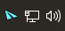
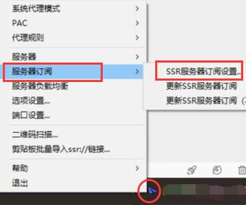
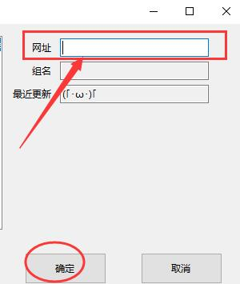
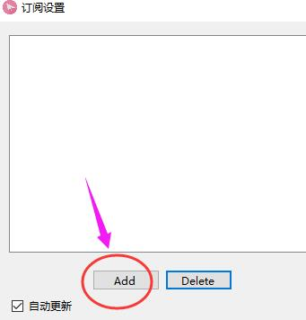
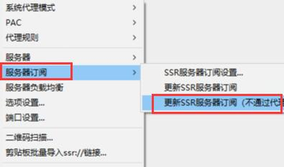
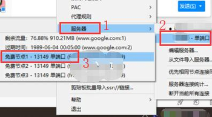

# Windows - ShadowsocksR 4.7.0 #
- 系统要求： Windows XP 及以上
- 设备要求： Windows 计算机
- [点此下载软件](https://download.blinkload.net/ShadowsocksR-4.7.0-win.7z)

### 软件安装 ###
1. 您可以在上方找到**ShadowsocksR**客户端的下载链接，下载完毕后将压缩包解压到任意文件夹。Windows 7及以上用户请选择**"ShadowsocksR-dotnet4.0"**，WindowsXP用户请选择 **"ShadowsocksR-dotnet2.0"**。

2. 双击打开后，即可在任务栏中看到如图所示的**小飞机图标**（颜色会因配置不同而改变）。

### 导入节点设置 ###
?> 您可以在[在此处获取](/panel?id=连接信息)订阅链接教程

1.在小飞机图标上单击右键。

2.选择[服务器订阅]。

3.选择[SSR服务器订阅设置]。

4.完成以上步骤后将出现如图所示的对话框，并请在**网址**粘贴之前在第一步复制的**订阅地址**

1. 单击[Add]按钮。

2. 复制**订阅链接**到[网址]。

3. 勾选[自动更新]，点击[确认]按钮。

   

!> 因客户端开发问题，可能会遇到无法保存订阅链接的问题，如果遇到此问题，请再次尝试添加，我们将在以后修复这个问题。

5.点击[更新SSR服务器订阅（不通过代理）]，等待出现 **SSR服务器订阅更新成功** 提示；如出现 **SSR服务器订阅更新失败** 请检查您添加的链接是否正确。

6.如图所示选择节点，即可访问网络。

### 软件设置 ###
> 此处为软件设置优化教程，在这里您可以 设置开机启动，负载均衡 等。如果您曾经使用过ShadowsocksR软件，可以选择跳过该部分。

##### 自动运行 #####
?> 开机启动会使ShadowsocksR服务在您登陆系统后自动运行。
1. 右键**小飞机图标**。

2. 选择[选项设置]。

3. 勾选[开机启动]。

4. 点击[确定]按钮。（此时您可能需要同意UAC权限）

##### PAC自动分流 #####
?> **PAC自动分流**将根据您访问的服务器所在地理位置自动分流，如访问的服务器在国内则不通过**ShadowsocksR服务** 直接连接，服务在国外则通过**ShadowsocksR服务**连接。该项设置可帮助您提高页面访问速度并且节省**ShadowsocksR**流量。

##### 负载均衡 #####
?> ShadowsocksR负载均衡 开启后，软件将自动为您选择您当前所在区域最优节点。

!> 注意，开启负载均衡后可能会导致**流媒体解锁功能失效**，如无法观看 Netflix HBO 等。请您关闭负载均衡观看。
